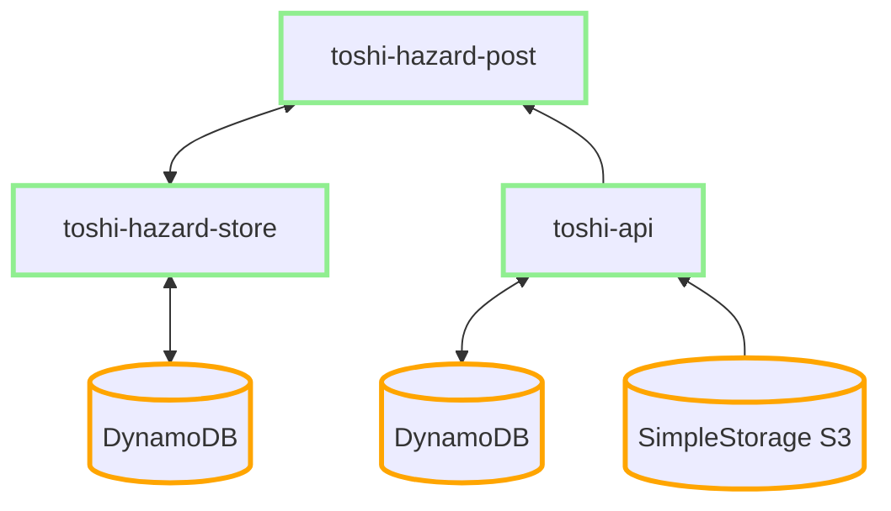

toshi-hazard-post relies on two data storage, lookup, and retrieval services provided by the NSHM project:

- [Toshi API](https://github.com/GNS-Science/simple-toshi-ui), accessed via the [Python client](https://github.com/GNS-Science/nshm-toshi-client) to retrieve disaggregation realizations.
- [toshi-hazard-store](https://github.com/GNS-Science/toshi-hazard-store) to retrive hazard curve realizations and store hazard curve and disaggregation aggregates.

Furthermore, toshi-hazard-post relies on two other NSHM packages to define common entities used by hazard models:

- [nzshm-common](https://github.com/GNS-Science/nzshm-common-py) to define locations (sites) either on regular grids or as named locations (used for population centres).
- [nzhsm-model](https://github.com/GNS-Science/nzshm-model) to define seismicity rate logic tree structure.